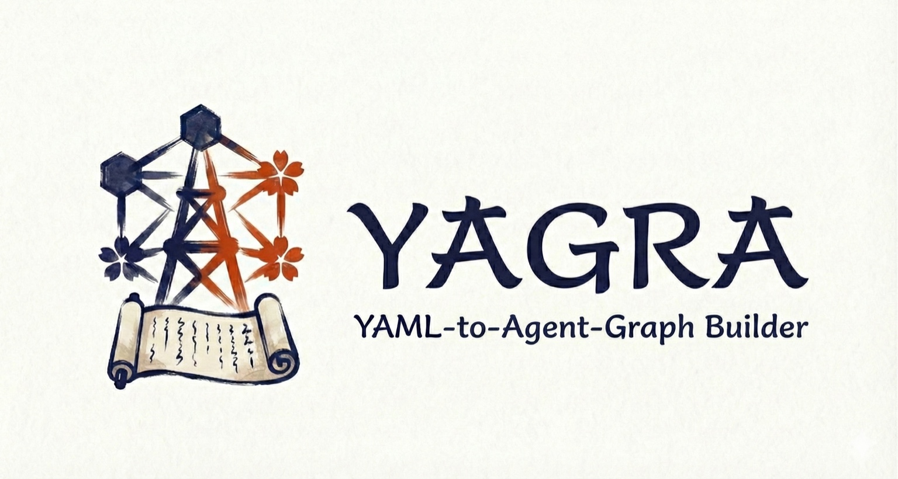

# Yagra

<p align="center">
  
</p>

<p align="center">
  <a href="https://github.com/shogo-hs/Yagra/actions/workflows/ci.yml"></a>
  <a href="https://pypi.org/project/yagra/"></a>
  <a href="https://pypi.org/project/yagra/"></a>
  <a href="https://github.com/shogo-hs/Yagra/blob/main/LICENSE"></a>
  <a href="https://pypi.org/project/yagra/"></a>
</p>

**Declarative LangGraph Builder powered by YAML**

Yagra enables you to build [LangGraph](https://langchain-ai.github.io/langgraph/)'s `StateGraph` from YAML definitions, separating workflow logic from Python implementation. Define nodes, edges, and branching conditions in YAML files—swap configurations without touching code.

Designed for **LLM agent developers**, **prompt engineers**, and **non-technical stakeholders** who want to iterate on workflows quickly without diving into Python code every time.

Built with **AI-Native principles**: JSON Schema export and validation CLI enable coding agents (Claude Code, Codex, etc.) to generate and validate workflows automatically.

## ✨ Key Features

- **Declarative Workflow Management**: Define nodes, edges, and conditional branching in YAML
- **Implementation-Configuration Separation**: Connect YAML `handler` strings to Python callables via Registry
- **Schema Validation**: Catch configuration errors early with Pydantic-based validation
- **Visual Workflow Editor**: Launch Studio WebUI for visual editing, drag-and-drop node/edge management, and diff preview
- **Template Library**: Quick-start templates for common patterns (branching, loops, RAG)
- **AI-Ready**: JSON Schema export (`yagra schema`) and structured validation for coding agents

## 📦 Installation

- Python 3.12+

```bash
pip install yagra
```

## 🚀 Quick Start

### Option 1: From Template (Recommended)

Yagra provides ready-to-use templates for common workflow patterns.

```bash
# List available templates
yagra init --list

# Initialize from a template
yagra init --template branch --output my-workflow

# Validate the generated workflow
yagra validate --workflow my-workflow/workflow.yaml
```

Available templates:
- **branch**: Conditional branching pattern
- **loop**: Planner → Evaluator loop pattern
- **rag**: Retrieve → Rerank → Generate RAG pattern

### Option 2: From Scratch

#### 1. Define State and Handler Functions

```python
from typing import TypedDict
from yagra import Yagra


class AgentState(TypedDict, total=False):
    query: str
    intent: str
    answer: str
    __next__: str  # For conditional branching


def classify_intent(state: AgentState, params: dict) -> dict:
    intent = "faq" if "料金" in state.get("query", "") else "general"
    return {"intent": intent, "__next__": intent}


def answer_faq(state: AgentState, params: dict) -> dict:
    prompt = params.get("prompt", {})
    return {"answer": f"FAQ: {prompt.get('system', '')}"}


def answer_general(state: AgentState, params: dict) -> dict:
    model = params.get("model", {})
    return {"answer": f"GENERAL via {model.get('name', 'unknown')}"}


def finish(state: AgentState, params: dict) -> dict:
    return {"answer": state.get("answer", "")}
```

#### 2. Define Workflow YAML

`workflows/support.yaml`

```yaml
version: "1.0"
start_at: "classifier"
end_at:
  - "finish"

nodes:
  - id: "classifier"
    handler: "classify_intent"
  - id: "faq_bot"
    handler: "answer_faq"
    params:
      prompt_ref: "../prompts/support_prompts.yaml#faq"
  - id: "general_bot"
    handler: "answer_general"
    params:
      model:
        provider: "openai"
        name: "gpt-4.1-mini"
  - id: "finish"
    handler: "finish"

edges:
  - source: "classifier"
    target: "faq_bot"
    condition: "faq"
  - source: "classifier"
    target: "general_bot"
    condition: "general"
  - source: "faq_bot"
    target: "finish"
  - source: "general_bot"
    target: "finish"
```

#### 3. Register Handlers and Run

```python
registry = {
    "classify_intent": classify_intent,
    "answer_faq": answer_faq,
    "answer_general": answer_general,
    "finish": finish,
}

app = Yagra.from_workflow(
    workflow_path="workflows/support.yaml",
    registry=registry,
    state_schema=AgentState,
)

result = app.invoke({"query": "料金を教えて"})
print(result["answer"])
```

## 🛠️ CLI Tools

Yagra provides CLI commands for workflow management:

### `yagra init`

Initialize a workflow from a template.

```bash
yagra init --template branch --output my-workflow
```

### `yagra schema`

Export JSON Schema for workflow YAML (useful for coding agents).

```bash
yagra schema --output workflow-schema.json
```

### `yagra validate`

Validate a workflow YAML and report issues.

```bash
# Human-readable output
yagra validate --workflow workflows/support.yaml

# JSON output for agent consumption
yagra validate --workflow workflows/support.yaml --format json
```

### `yagra visualize`

Generate a read-only visualization HTML.

```bash
yagra visualize --workflow workflows/support.yaml --output /tmp/workflow.html
```

### `yagra studio`

Launch an interactive WebUI for visual editing, drag-and-drop node/edge management, and workflow persistence.

```bash
# Launch with workflow selector (recommended)
yagra studio --port 8787

# Launch with a specific workflow
yagra studio --workflow workflows/support.yaml --port 8787
```

Open `http://127.0.0.1:8787/` in your browser.

**Studio Features:**
- **Visual Editing**: Edit prompts, models, and conditions via forms
- **Drag & Drop**: Add nodes, connect edges, adjust layout visually
- **Diff Preview**: Review changes before saving
- **Backup & Rollback**: Automatic backups with rollback support
- **Validation**: Real-time validation with detailed error messages

## 📚 Documentation

Full documentation is available at **[shogo-hs.github.io/Yagra](https://shogo-hs.github.io/Yagra/)**

- **[User Guide](https://shogo-hs.github.io/Yagra/)**: Installation, YAML syntax, CLI tools
- **[API Reference](https://shogo-hs.github.io/Yagra/api.html)**: Python API documentation
- **[Examples](https://shogo-hs.github.io/Yagra/examples.html)**: Practical use cases

You can also build documentation locally:

```bash
uv run sphinx-build -b html docs/sphinx/source docs/sphinx/_build/html
```

## 🎯 Use Cases

- Prototype LLM agent flows and iterate rapidly by swapping YAML files
- Enable non-engineers to adjust workflows (prompts, models, branching) without code changes
- Integrate with coding agents for automated workflow generation and validation
- Reduce boilerplate code when building LangGraph applications with complex control flow

## 🤝 Contributing

Contributions are welcome! Please see [CONTRIBUTING.md](CONTRIBUTING.md) for development setup, coding standards, and guidelines.

## 📄 License

MIT License - see [LICENSE](LICENSE) for details.

## 📝 Changelog

See [CHANGELOG.md](CHANGELOG.md) for release history.

---

<p align="center">
  <sub>Built with ❤️ for the LangGraph community</sub>
</p>
